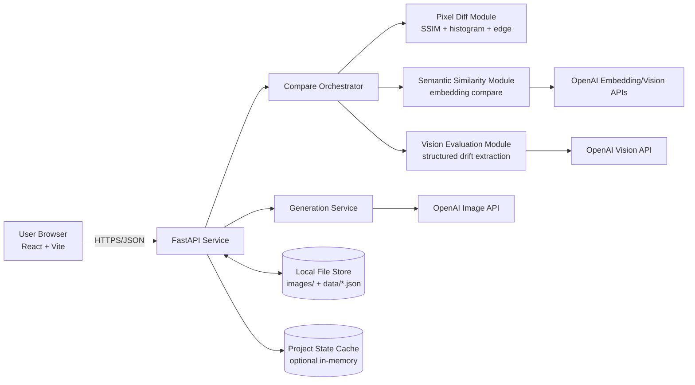
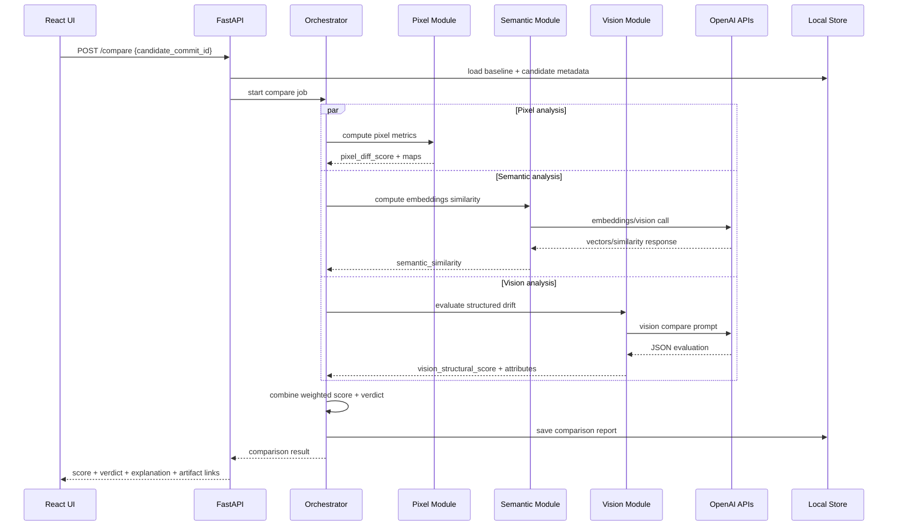

# Promptsmith PRD

Document status: Draft v2 (hackathon implementation-ready)
Last updated: 2026-02-28
Owners: Product, Engineering

## Split Execution Docs (No Overlap)

For parallel execution with strict ownership boundaries, use:
- Track A (Backend + AI Engine): `prd-track-a-backend-ai.md`
- Track B (Frontend + Demo Experience): `prd-track-b-frontend-demo.md`

These two docs are the authoritative implementation split for team execution.
Development standard for both tracks: use `pnpm` scripts from repo root.

## 0. Audit Of Original Draft

### What was strong
- Clear core idea: treat AI image generations like software builds with commits and regression checks.
- Strong hackathon narrative: "CI for generative art" is understandable and memorable.
- Reasonable first-pass scoring concept combining pixel, semantic, and model-evaluated drift.
- Practical MVP scope: character consistency instead of broad artistic control.

### What this version now includes
- Complete PRD structure: objectives, personas, user stories, FR/NFR, and success metrics.
- Technical architecture diagrams (component + sequence) and deployment topology.
- Explicit API contracts, error schema, and data model.
- Drift-score calibration protocol, observability, operations, and risk register.
- Hackathon execution plan with feasibility constraints and demo checklist.

## 1. Product Overview

### Product name
Promptsmith

### Vision
Bring software engineering discipline (versioning, reproducibility, and regression testing) to generative character art workflows.

### Product thesis
Creative teams need a way to detect when prompt changes unintentionally alter core character identity. Promptsmith provides repeatable generation runs, baseline controls, and automated drift scoring to make prompt iteration safe.

## 2. Problem Statement

AI-native art teams cannot reliably answer:
- Did this prompt update preserve character identity?
- What changed between outputs and why?
- Can we reproduce a previous "good" generation state?

Current pain points:
- Character drift across prompt edits.
- Inconsistent style and lighting over iterations.
- Low reproducibility due to missing run metadata.
- Manual visual checks that are slow and subjective.

## 3. Goals, Non-Goals, And Success Metrics

### Goals (MVP)
- Version every generation as a commit-like artifact.
- Allow users to set a baseline image set.
- Compute and explain drift when prompts change.
- Surface regression verdicts quickly enough for iterative use.

### Non-goals (hackathon)
- Multi-tenant collaboration.
- Fine-tuning or model training.
- Real-time collaborative editing.
- Enterprise-grade security controls.

### Success metrics (hackathon)
- Functional: 100% of committed runs retain reproducibility metadata (prompt, model, seed, timestamp).
- UX: user can complete baseline -> prompt change -> compare flow in <= 90 seconds.
- Performance: p95 compare pipeline latency <= 20 seconds at 1024px input.
- Quality: >= 80% agreement with human labels on a small validation set (n >= 30 comparisons).
- Demo stability: zero blocking errors over 3 consecutive full demo rehearsals.

## 4. Target Users And Personas

### Primary personas
1. Indie game character pipeline owner
- Needs consistency across concept variations.
- Cares about reproducibility and auditability.

2. AI-native character artist
- Iterates quickly with prompt edits.
- Needs instant feedback on identity drift.

3. VTuber/brand avatar creator
- Needs stable facial structure while changing outfits/lighting.

### Secondary personas
- Marketing teams maintaining brand mascots.
- AI art marketplace creators validating character continuity.

## 5. User Stories With Acceptance Criteria

1. As an artist, I can create a generation commit from a prompt.
- Accept when commit stores prompt, model, seed (if available), image URIs, and timestamp.

2. As a user, I can select one commit as baseline.
- Accept when baseline pointer updates and is visible in history.

3. As a user, I can compare a new commit to baseline and get a drift verdict.
- Accept when score, threshold, pass/fail, and factor breakdown are returned.

4. As a user, I can inspect visual and semantic difference evidence.
- Accept when side-by-side view, diff heatmap, and explanation JSON are shown.

5. As a user, I can reproduce a prior run.
- Accept when re-run endpoint can regenerate using stored metadata and produce new comparison report.

## 6. Scope Definition

### In scope (MVP)
- Single-user local project workspace.
- Prompt commit history.
- Baseline selection.
- Drift scoring (pixel + semantic + vision assessment).
- JSON-backed persistence and local image storage.
- Web UI for generation, comparison, and history.

### Out of scope (MVP)
- Team accounts and RBAC.
- External webhook/CI integrations.
- Multi-model orchestration with per-model tuning.
- Automated prompt rewrite suggestions.

## 7. Functional Requirements

### FR-001 Commit management
- System shall create immutable commit records for each generation run.
- System shall assign monotonic commit IDs (`c0001`, `c0002`, ...).
- System shall store image artifact references per commit.

### FR-002 Baseline management
- System shall allow setting exactly one active baseline per project.
- System shall retain baseline history (who/when in future multi-user mode; for MVP, timestamp only).

### FR-003 Comparison engine
- System shall compare target commit to active baseline.
- System shall compute sub-scores:
- `pixel_diff_score` (0..1, higher means more different).
- `semantic_similarity` (0..1, higher means more similar).
- `vision_structural_score` (0..1, higher means more drift).
- System shall compute final drift score and verdict based on threshold.

### FR-004 Explainability
- System shall return machine-readable explanation JSON with detected drift attributes (face, pose, lighting, style).
- System shall expose per-factor contribution percentages.

### FR-005 History and reproducibility
- System shall provide paginated commit history.
- System shall support rerun from selected commit metadata.

### FR-006 UI workflows
- System shall support baseline creation and compare flow without terminal usage.
- System shall render side-by-side images and optional diff overlay.

## 8. Non-Functional Requirements

### NFR-001 Performance
- p95 `/compare` end-to-end <= 20 seconds for one baseline image vs one candidate image.
- p95 `/history` <= 400 ms for <= 1,000 commits.

### NFR-002 Reliability
- All writes are atomic at record level (write temp + rename).
- Recover gracefully from partial generation failures (status = `failed`, error preserved).

### NFR-003 Cost
- Configurable max image size and max compares/day to cap API usage.
- OpenAI is the only required paid dependency; all other required components run free locally.
- Estimated demo budget target <= USD 20 in OpenAI API credits.

### NFR-004 Security and privacy
- API keys never returned to client.
- Logs redact prompts only if `REDACT_PROMPTS=true` (default false for demo).
- Local storage path must remain under project workspace.

### NFR-005 Observability
- Structured logs with request ID and commit ID.
- Basic metrics: generation_count, compare_count, compare_latency_ms, error_rate.

## 9. Technical Architecture

### 9.1 Component architecture



### 9.2 Comparison request sequence



### 9.3 Deployment topology (hackathon)
- Preferred for demo reliability: fully local stack (`npm run dev` + `uvicorn`) with local filesystem storage.
- Optional hosted frontend: Vercel Hobby (free) or Cloudflare Pages Free.
- Optional hosted backend: Render Free web service (acceptable for judging, but cold-start risk).
- No external DB required for MVP; Supabase Free is optional only if cloud persistence is needed.

## 10. Data Model

### 10.1 Entities

1. Project
- `project_id` (string)
- `name` (string)
- `active_baseline_commit_id` (string|null)
- `created_at`, `updated_at`

2. Commit
- `commit_id` (string)
- `project_id` (string)
- `prompt` (string)
- `model` (string)
- `seed` (string|null)
- `image_paths` (string[])
- `status` (`success|failed`)
- `error` (string|null)
- `created_at` (ISO timestamp)

3. ComparisonReport
- `report_id` (string)
- `project_id` (string)
- `baseline_commit_id` (string)
- `candidate_commit_id` (string)
- `pixel_diff_score` (number)
- `semantic_similarity` (number)
- `vision_structural_score` (number)
- `drift_score` (number)
- `threshold` (number)
- `verdict` (`pass|fail`)
- `explanation` (object)
- `artifacts` (diff map path, overlay path)
- `created_at` (ISO timestamp)

4. Config
- `weights` (object)
- `threshold` (number)
- `image_size` (string)
- `max_daily_compares` (number)

### 10.2 Local storage layout

```text
project-root/
  data/
    projects.json
    commits.json
    comparisons.json
    config.json
  images/
    c0001/
      img_01.png
    c0002/
      img_01.png
  artifacts/
    r0001/
      diff_heatmap.png
      overlay.png
```

## 11. API Specification (MVP)

### 11.1 `POST /generate`
Request:
```json
{
  "project_id": "default",
  "prompt": "cinematic portrait of hero character",
  "model": "gpt-image-1",
  "seed": "1234"
}
```
Response:
```json
{
  "commit_id": "c0007",
  "status": "success",
  "image_paths": ["images/c0007/img_01.png"],
  "created_at": "2026-02-28T18:10:12Z"
}
```

### 11.2 `POST /baseline`
Request:
```json
{
  "project_id": "default",
  "commit_id": "c0003"
}
```
Response:
```json
{
  "project_id": "default",
  "active_baseline_commit_id": "c0003",
  "updated_at": "2026-02-28T18:11:00Z"
}
```

### 11.3 `POST /compare`
Request:
```json
{
  "project_id": "default",
  "candidate_commit_id": "c0007"
}
```
Response:
```json
{
  "report_id": "r0012",
  "baseline_commit_id": "c0003",
  "candidate_commit_id": "c0007",
  "scores": {
    "pixel_diff_score": 0.22,
    "semantic_similarity": 0.86,
    "vision_structural_score": 0.31,
    "drift_score": 0.27,
    "threshold": 0.30
  },
  "verdict": "pass",
  "explanation": {
    "facial_structure_changed": false,
    "lighting_shift": "moderate",
    "style_drift": "low"
  },
  "artifacts": {
    "diff_heatmap": "artifacts/r0012/diff_heatmap.png",
    "overlay": "artifacts/r0012/overlay.png"
  }
}
```

### 11.4 `GET /history?project_id=default&limit=20&cursor=...`
Response:
```json
{
  "items": [
    {
      "commit_id": "c0007",
      "prompt": "...",
      "status": "success",
      "created_at": "2026-02-28T18:10:12Z"
    }
  ],
  "next_cursor": "c0006"
}
```

### 11.5 Error contract
All non-2xx responses:
```json
{
  "error": {
    "code": "BASELINE_NOT_SET",
    "message": "Set a baseline before comparing commits.",
    "request_id": "req_abc123"
  }
}
```

## 12. Drift Scoring Model

### 12.1 Formula (v1)

`drift_score = w1 * (1 - semantic_similarity) + w2 * pixel_diff_score + w3 * vision_structural_score`

Default weights:
- `w1 = 0.40`
- `w2 = 0.30`
- `w3 = 0.30`

Verdict logic:
- `pass` if `drift_score <= threshold`
- `fail` if `drift_score > threshold`
- Default `threshold = 0.30`

### 12.2 Calibration protocol
- Build labeled set of at least 30 baseline/candidate pairs.
- Human label each pair: `acceptable` or `regression`.
- Grid-search threshold from 0.20 to 0.50 (step 0.01).
- Pick threshold maximizing F1 for regression detection.
- If false positives > 20%, lower pixel weight first.

## 13. Frontend Requirements

### Primary screens
1. Prompt Workbench
- Prompt editor.
- Generate button.
- Commit status toast.

2. History Panel
- Commit list with timestamp and badges.
- Set baseline action.

3. Compare Dashboard
- Baseline vs candidate side-by-side.
- Drift score gauge + verdict badge.
- Diff overlay toggle.
- Structured explanation panel.

### UX acceptance criteria
- Baseline commit is visually pinned.
- Compare action disabled until baseline exists.
- Errors are recoverable with explicit retry action.

## 14. Backend Implementation Plan

### Services/modules
- `generation_service.py`: OpenAI image generation + artifact persistence.
- `comparison_orchestrator.py`: fan-out/fan-in scoring pipeline.
- `pixel_metrics.py`: SSIM/histogram/edge metrics + heatmap output.
- `semantic_metrics.py`: embedding extraction and cosine similarity.
- `vision_evaluator.py`: structured JSON drift extraction.
- `repository.py`: JSON file persistence with atomic writes.

### Concurrency model
- `/compare` executes sub-analyses concurrently (async tasks).
- If one sub-analysis fails, return partial metrics with `degraded=true` and fail-safe verdict policy:
- If semantic or vision missing, mark verdict as `inconclusive` unless pixel score is extreme (> 0.70).

## 15. Feasibility Review (10 Hours)

### Verdict
Feasible in 10 hours only if scope is kept strict and infrastructure remains local-first.

### Must-ship scope for 10 hours
1. `/generate`, `/baseline`, `/history`, `/compare` with JSON storage.
2. Pixel diff + one semantic signal + one vision-JSON explanation.
3. Single-image commit flow (not multi-image batches).
4. Simple React UI: prompt input, history list, baseline selector, compare panel.

### Defer if behind schedule
1. Embedding caching and advanced retries.
2. Hosted deployment (keep local for live demo).
3. Multi-image commit support and advanced overlays.
4. Threshold auto-calibration UI.

### Time budget reality check
1. Backend core APIs and storage: 3 hours.
2. Compare pipeline (pixel + semantic + vision): 3 hours.
3. Frontend wiring and visualization: 3 hours.
4. Demo script and hardening: 1 hour.

## 16. Services And Cost/Access Plan

### Required services
1. OpenAI API (assumed fully accessible): paid usage, core dependency for generation + vision.
2. Local filesystem: free, required for artifacts and metadata persistence.

### Optional free services
1. Vercel Hobby: free frontend hosting (best for personal/small-scale apps).
2. Cloudflare Pages Free: free static hosting (500 builds/month, unlimited static bandwidth).
3. Render Free: free backend hosting (750 free instance hours/month, spins down after 15 minutes idle).
4. Supabase Free: optional cloud persistence (2 free projects on free plan).

### Recommendation for hackathon
- Build and demo locally to avoid free-tier cold starts and quota surprises.
- Use hosted services only as backup/demo URL, not as critical path.

## 17. Observability And Operations

### Logging
- JSON logs with keys: `timestamp`, `level`, `request_id`, `route`, `commit_id`, `latency_ms`, `error_code`.

### Metrics
- `promptsmith_generate_total`
- `promptsmith_compare_total`
- `promptsmith_compare_latency_ms`
- `promptsmith_compare_fail_total`
- `promptsmith_api_error_total`

### Operational runbook (MVP)
- If OpenAI timeout > 15s, retry once with lower image size.
- If storage write fails, return 500 with `STORAGE_WRITE_FAILED` and skip partial save.

## 18. Security, Privacy, And Compliance

- API key stored server-side in environment variable only.
- No secrets in frontend bundle.
- Prompt/image data treated as sensitive creative assets; avoid external sharing in logs.
- For hosted mode, require TLS and basic auth at minimum.

## 19. Risks And Mitigations

1. Risk: Latency from multiple model calls.
- Mitigation: parallel pipeline + image size limits + optional cached embeddings.

2. Risk: Drift score instability across styles.
- Mitigation: threshold calibration set per project profile.

3. Risk: Judge skepticism ("wrapper" perception).
- Mitigation: emphasize reproducibility, deterministic metadata, and explainable scoring internals.

4. Risk: API quota/cost overrun during live demo.
- Mitigation: pre-generate demo commits and keep one live compare for real-time proof.

## 20. Hackathon Delivery Plan (10 hours)

1. Hour 1-2: backend skeleton + `/generate` + local storage.
2. Hour 3-4: baseline + history + basic React shell.
3. Hour 5-6: pixel metrics + artifacts.
4. Hour 7: semantic + vision evaluators.
5. Hour 8: weighted drift scoring + verdict API.
6. Hour 9: UI polish + explanation panel.
7. Hour 10: demo script, rehearsals, fallback dataset.

## 21. Demo Script And Acceptance Checklist

### Demo script
1. Generate baseline character commit (`c0001`).
2. Set `c0001` as baseline.
3. Generate modified prompt commit (`c0002`) with intentional face drift.
4. Run compare and show fail verdict + score breakdown + diff overlay.
5. Regenerate with only lighting change (`c0003`) and show pass/mild score.
6. Show commit metadata and reproducibility fields.

### Acceptance checklist
- [ ] Baseline set and visible in UI.
- [ ] At least one regression correctly flagged.
- [ ] Explanation JSON shown in dashboard.
- [ ] History includes prompt/model/seed/timestamp.
- [ ] End-to-end flow works without manual file edits.

## 22. Future Extensions

- Multi-character identity sets per project.
- CI webhook integration (`/compare` on PR of prompt files).
- Cloud artifact store and signed URLs.
- Collaborative review comments on comparison reports.
- Model-specific calibration profiles.
